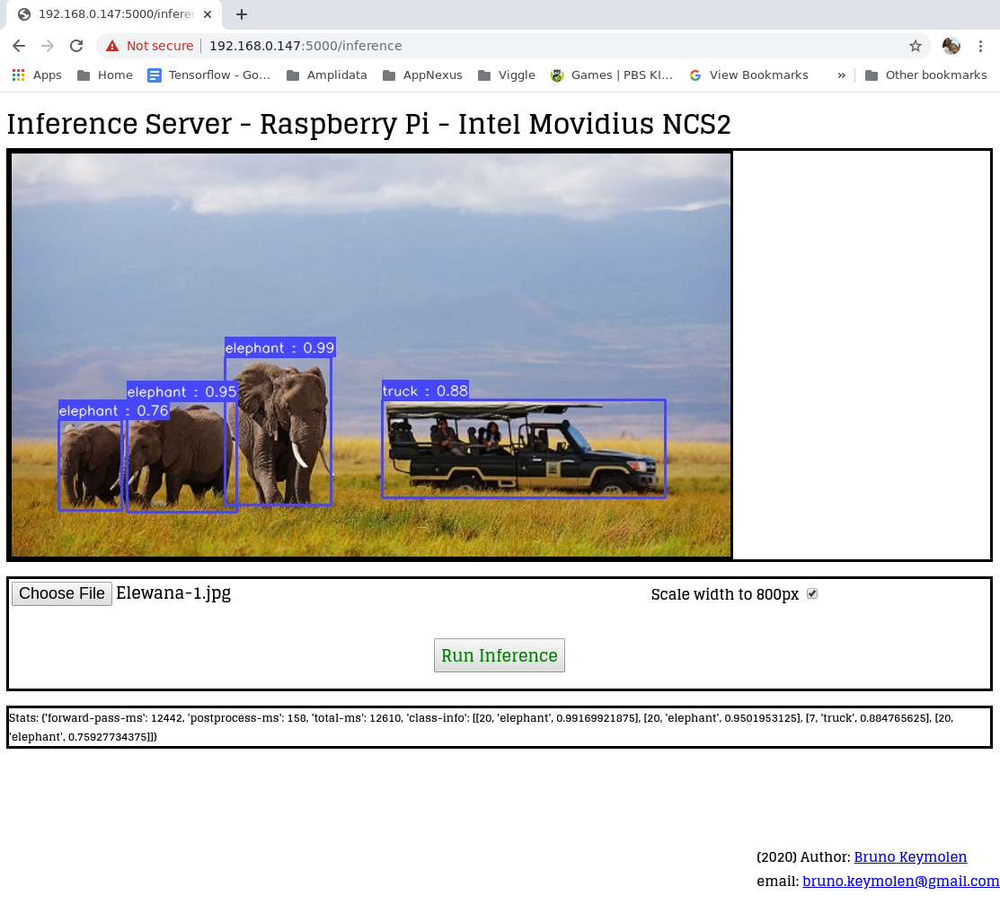

YOLOv3 COCO Inference Web Service for Intel® Movidius NCS2
==========================================================

Intro
--------
This project is originally made to run on a Raspberry Pi, though it should run on any linux device that has OpenVINO and NCS2 support.
http://www.keymolen.com

Dependencies:
------------

coco.names 
wget https://raw.githubusercontent.com/pjreddie/darknet/master/data/coco.names

frozen_darknet_yolov3_model.xml 
frozen_darknet_yolov3_model.bin 

These is a converted YoloV3 Darknet model to Intel Movidius IR. 
original models: https://pjreddie.com/darknet/yolo/

Tutorial to convert models to Intel Movidius IR
http://www.keymolen.com/2020/04/run-yolov3-on-raspberry-pi-with-intel.html

Run
---
python3 movidius-inference-server.py
